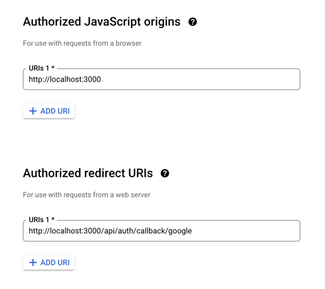

# Setup Auth.js

## Install Auth.js

* Install dependencies: `npm install next-auth@beta @auth/prisma-adapter`
* Setup environment by generating `AUTH_SECRET`: `npx auth secret`
  * The library uses this random value to encrypt tokens and email verification hashes.
  * By default, the value is saved to `.env.local`. Move it to your environment file. Then you can delete `.env.local`.
  * You must also define it in the production.
* Create the following files following [this reference](https://authjs.dev/getting-started/installation?framework=next-js):
  * [auth.ts](../../auth.ts)
  * [route.ts](../../app/api/auth/%5B...nextauth%5D/route.ts)
  * [middleware.ts](../../middleware.ts)

### References

* https://authjs.dev/getting-started/installation?framework=next-js
* https://authjs.dev/getting-started/adapters/prisma?framework=next-js

## Configure Provider

### Setup Google Provider

* Set environment variables: `AUTH_GOOGLE_ID` and `AUTH_GOOGLE_SECRET`.
* Add `Google` as a providers in [auth.ts](../../auth.ts)

### Configure Google OAuth

####  Configure Google App

* Go to https://console.developers.google.com/apis/credentials
* Create a project.

#### OAuth consent screen

* Branding
  * App information
    * App name: `ENTER_ANY_DATA`
    * User support email: `SELECT_EMAIL_FROM_DROPDOWN`
      * The only email you can select here is the email account associated with this GCP account.
      * This will be exposed to the login screen. Therefore, prefer to create a new account for Google OAuth.
    * App domain (localhost is not allowed here)
      * Application home page
        * `https://www.example.com/`
      * Authorized domains
        * `example.com`
    * Developer contact information: `ENTER_ANY_DATA`
* Audience: `External`
  * Test users
    * User information: `ENTER_DATA_TO_BE_USED_AS_TEST_USER`
* Scopes
  * `./auth/userinfo.email`
  * `./auth/userinfo.profile`

#### Credentials

* Click on `+ CREATE CREDENTIALS` and select `OAuth client ID`
* Application type: `Web application`
* Name: `ENTER_ANY_DATA`
* Authorized JavaScript origins:
  * https://example.com
  * http://localhost:3000
  * https://brandname.vercel.app
* Authorized redirect URIs
  * https://example.com/api/auth/callback/google
  * http://localhost:3000/api/auth/callback/google
  * https://brandname.vercel.app/api/auth/callback/google

> `Authorized JavaScript origins` is just the domain name; no slash at the end.

> `Authorized redirect URI` is the URI where the redirection should take place after authentication.

> You will get Client ID and Client Secret after creation of the credentials.

### References

* https://authjs.dev/getting-started/providers/google?framework=next-js
* https://developers.google.com/identity/protocols/oauth2

## Test Signing in with Google OAuth

* https://example.com/api/auth/signin
* http://localhost:3000/api/auth/signin
